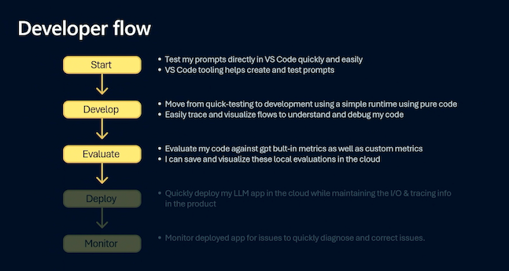

# Overview

## Motivation

Building generative AI applications requires a process of repeated iterations from prompt design to production deployment. Generative AI Ops defines the app lifecycle in three stages, as shown:

1. **Ideation** - building the initial prototype.
1. **Evaluation** - assessing prototype for quality and safety
1. **Operationalization** - deploying prototype to production

The challenge for developers lies in reducing the time and complexity associated with the first two stages, so they can move more quickly from designing the initial prompt to having a production-ready deployment.

---

## What is Prompty?

Prompty is an [open-source project](https://github.com/microsoft/prompty) from Microsoft that brings _agency with observability_ to the prompt engineering and rapid prototyping process. It contists of three components:

- **Specification** - defining the file format for versionable `.prompty` assets.
- **Tooling** - simplifying developer experience in creating and managing those assets.
- **Runtime** - converting assets to code for interactive testing & orchestated workflows.

With Prompty, you effectively get a _playground in your IDE_, with three critical features for developers:

- **Customizability** - easily switch & configure models and behaviors for prompt engineering 
- **Composability** - think "micro-orchestrators" that can be composed into more complex flows 
- **Observability** - debug and analyze workflows with trace data and visualizations

When we say Prompty has _"agency with observability"_, we mean that it gives us the power to customize and compose models and behaviors at the granularity of a single LLM call - then empowers us to trace the execution of the calls from request to response to understand and optimize for cost or performance.

---

## Where to use Prompty?

The basic building block of the generative AI application is the **API call**- a request is made (user prompt), gets processed by a language model (inference task), and the response gets delivered back to the user (result).

Based on use case, the "processing" step can expand into more complex workflows (e.g., retrieval augmented generation, multi-agent conversations etc.) that require **orchestration** of multiple models and services. This has led to orchestration frameworks like Prompt flow, LangChain and Semantic Kernel that manage _data flow_ and _async interaction_ requirements for the application.

But it also leaves a gap (and opportunity) for **micro-orchestrators** that handle expanded processing and optimization for a single API call (step) before tackling multi-model, multi-step workflows. These micro-orchestrators should be lightweight, composable and observable. Prompty was designed to fill this gap.

Developers can now "unit test" Prompty assets for quality and safety before using them with higher-level frameworks to orchestrsate complex workflows. Those frameworks can now focus on "integration" and "end-to-end" testing of the workflows, knowing that base component quality and safety requirements were already validated.

---

## How to use Prompty

Prompty is designed to be used in the early stages of the generative AI application lifecycle, where developers are designing and testing prompts for quality and safety. 

1. **Design** your application by creating a Prompty asset with a default model and prompt.
1. **Develop** your prototype by iterating on model (configuration) and prompt (template).
1. **Evaluate** your prototype for quality and safety using custom Prompty evaluators (runtime)

It is in the last step that we can take advantage of Prompty tooling that interfaces to popular orchestration frameworks to chain together _chat_ and _evaluation_ Prompty assets for assessing quality against a more diverse set of input request prompts.

---
